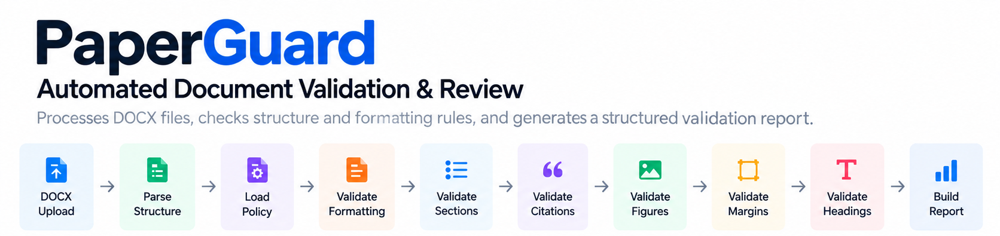
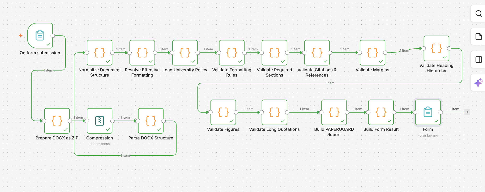
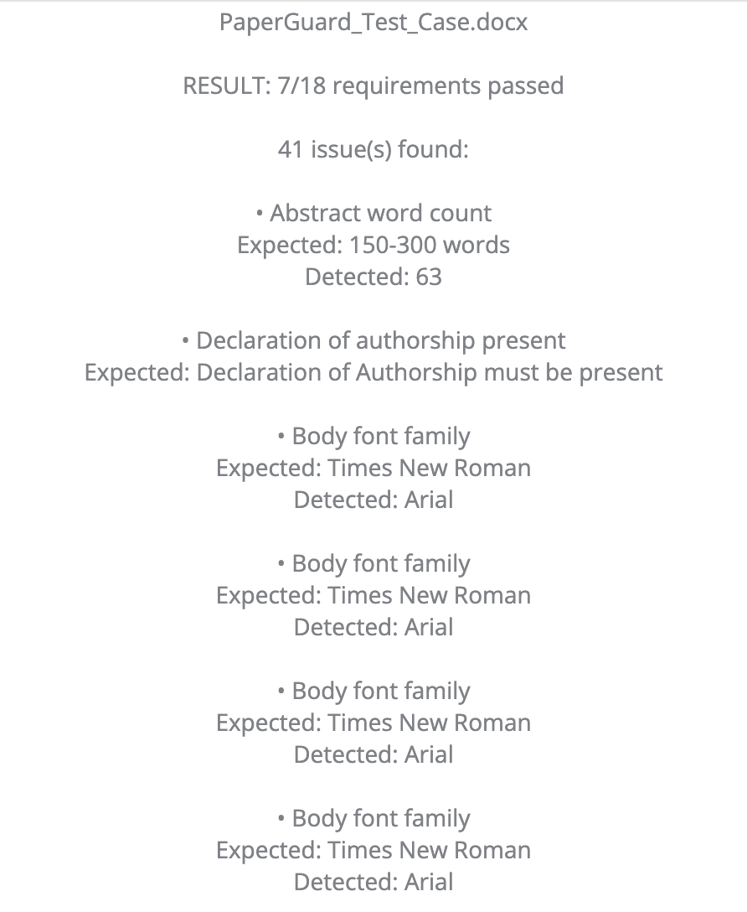

# PAPERGUARD — Document Validation & Review Workflow

**Checking a document against a specification means dozens of small, easy-to-miss comparisons. PAPERGUARD is an n8n workflow that reads a DOCX's underlying structure, checks it against an explicit policy pack, and returns a report with evidence, flagging the cases a person should look at.**

| | |
| --- | --- |
| **Input** | a `.docx` uploaded through an n8n form |
| **Checks** | 18 policies: sections, abstract length, fonts, spacing, margins, citations, figures, quotations, heading hierarchy |
| **Returns** | `PASS` / `FAIL` / `REVIEW_REQUIRED` per policy, with expected vs. detected values |
| **Uses AI?** | no; validation is deterministic, and ambiguous figure/quotation cases go to a person |
| **Status** | portfolio implementation; template-sensitive parser, no general DOCX compatibility guarantee |

```text
DOCX upload → decompress OOXML → parse document and styles
  → normalized paragraphs and formatting → policy pack
  → structure / typography / citations / margins / headings / figures / quotations
  → structured report → readable form result
```



## What's in this repo

- [`workflow/paperguard.json`](workflow/paperguard.json): the exported n8n workflow (inactive, built-in nodes only, no credentials needed)
- [`tests/smoke.mjs`](tests/smoke.mjs): runs the exported normalization and validation code, including missing-reference and review-state cases
- [`examples/`](examples/): synthetic OOXML input and the generated report
- [`docs/implementation-notes.md`](docs/implementation-notes.md): parser assumptions and known limits

## Why no LLM

Margins, fonts, section order and citation matching have right answers, and code checks them the same way every time. A model would add cost and variability without improving those checks. Where the answer is genuinely unclear, such as figure attribution or uncertain quotations, the report marks the case `REVIEW_REQUIRED` instead of guessing. PAPERGUARD does not assess academic merit, verify facts or detect plagiarism.

## How it works

1. **Extract the document.** Treat DOCX as a ZIP archive, read document/style XML, and normalize paragraphs, text runs, spacing, margins, drawings, and heading information.
2. **Resolve formatting.** Combine explicit run formatting with document defaults. The current implementation does not resolve the full Word style-inheritance model.
3. **Load policy.** An embedded 18-rule pack defines sections, abstract length, fonts, spacing, margins, citations, figures, quotations, and heading hierarchy. Its public identity is illustrative; it is not presented as an official university standard.
4. **Evaluate evidence.** Check section labels and abstract bounds, compare detected formatting to policy values, match supported author/year citation patterns against references, and inspect figure/quotation evidence.
5. **Build a report.** Aggregate policy-level statuses, issue details, expected versus detected values, counts, and document statistics. A final form displays a readable result.

| Result | Meaning in this export |
| --- | --- |
| `PASS` | The implemented check found no violation |
| `FAIL` | A check reports a violation; some missing-data cases also fail |
| `REVIEW_REQUIRED` | Selected figure/quotation cases need human judgment, or the aggregate report has unchecked policies |
| `NOT_CHECKED` | The report cannot map a completed check result |
| `SKIPPED` | An intermediate validator skipped work, for example citations without a References section; normalized to `NOT_CHECKED` in the final report |

## Reliability / edge cases

Policies and results remain explicit JSON rather than an opaque score. Figure ownership/source attribution and uncertain quotation candidates can be surfaced for review. Missing references skip citation validation; absent margin data becomes a reported failure. Required policies are checked before several validators run, and missing definitions throw explicit errors.

The import is template-sensitive: **Parse DOCX Structure** reads fixed decompression properties `file_4` and `file_6`. Verify that these contain `word/document.xml` and `word/styles.xml` for your test file. XML parsing uses regular expressions, section recognition expects particular labels, and title-page presence is a paragraph-count heuristic. Missing abstract boundaries currently produce `FAIL` in the final report because its boolean `pass` remains false. These limits are preserved and documented in [implementation notes](docs/implementation-notes.md).

No automatic retries, general DOCX compatibility guarantee, or human approval application is included. Review states are report outcomes for a person to inspect.

## Tech stack

- n8n Form Trigger, Compression, Code, and Form nodes
- JavaScript and DOCX / OOXML structure extraction
- Explicit policy checks and structured JSON reports
- Deterministic validation with targeted review heuristics

## Screenshots



*Original full n8n workflow, showing extraction, validation, and report stages.*



*Original test-document result excerpt: 7 of 18 requirements passed, with 41 reported issues. This is a single test case, not an accuracy metric.*

## Example

The [synthetic OOXML input](examples/input.json) describes a short document with Arial body text and a missing authorship declaration. The [generated report](examples/output.json) records policy failures and expected/detected evidence.

The smoke test runs the exported normalization and validation Code nodes, including missing-reference and review-state checks:

```sh
node tests/smoke.mjs
```

The fixture starts at extracted XML. It does not test DOCX upload, ZIP entry numbering, or Word rendering.

## What this project demonstrates

- Document normalization before validation
- Policy-driven checks with inspectable evidence
- Separation of deterministic checks and ambiguous review cases
- Structured report generation
- Honest handling of parser and template limitations

## Running / importing the workflow

1. Import [workflow/paperguard.json](workflow/paperguard.json) into an isolated n8n instance. It is inactive and uses built-in nodes.
2. Review **Load University Policy** and adapt the example requirements to your actual document specification. No external API or AI credential is required.
3. Open the test form and upload a small synthetic `.docx` using the **Academic Paper** field.
4. Inspect the Compression output. Verify the document/style XML properties used by **Parse DOCX Structure**, and adjust those property names in your private copy if needed.
5. Inspect the normalized representation, then the report, for known positive and negative cases. Do not treat `PASS` as proof that every visual requirement in Word has been checked.

## Notes

The public export removes form webhook IDs and installation metadata, regenerates node IDs, and replaces institution-specific policy-pack attribution with example metadata. Validation logic and connections are preserved. Original papers and their author metadata are not included. See [publication notes](docs/publication-notes.md).
